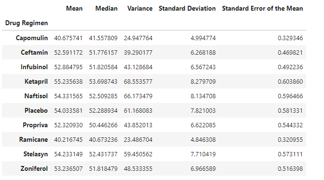

# Module 5 - Pymaceuticals

In this study, 249 mice identified with SCC tumor growth were treated with a variety of drug regimens. Over the course of 45 days, tumor development was observed and measured. The purpose of this study was to compare the performance of Pymaceuticals' drug of interest, Capomulin, versus the other treatment regimens.

The following visualizations were created:

Summary statistics dataframe

Bar plot showing the total number of timepoints for all mice tested for each drug regimen throughout the course of the study

Pie chart showing the distribution of female or male mice in the study

Box plot of the final tumor volume for all four treatment regimens

Line plot of volume versus timepoint for Capomulin treatmeant of mouse l509

Linear regression model between mouse weight and average tumor volume for the Capomulin treatment plotted on top of the scatter plot
regression

# Analysis

Capomulin and Ramicane were two of the drugs whose tumor levels in this study were smallest by the end of the data measurements. There was an even split between male and female mouses studied. The true effectiveness of these drugs would be better displayed using a subplot compairing the mean of tumor size vs time for each drug to show true effectiveness.
